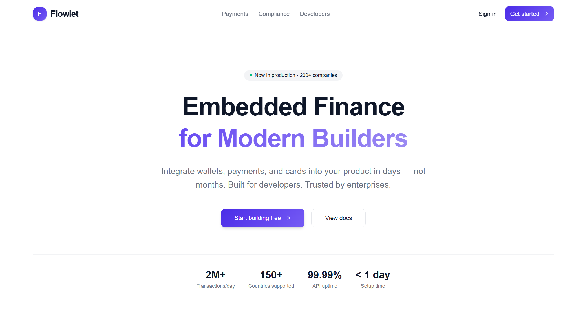

# Flowlet


## Embedded Finance Platform

Flowlet is an embedded finance platform: a single Flask application exposing wallets, payments, card issuance, KYC/AML compliance, a double-entry ledger, and a no-code workflow engine through one REST API, paired with a React web dashboard. A separate ML service trains and serves a genuine fraud-detection ensemble (XGBoost, LightGBM, Random Forest, and Isolation Forest) that's wired into the live API rather than sitting disconnected.

<div align="center">
  
</div>

## Table of Contents

- [Overview](#overview)
- [Project Structure](#project-structure)
- [Feature Status](#feature-status)
- [Technology Stack](#technology-stack)
- [Architecture](#architecture)
- [Installation and Setup](#installation-and-setup)
- [Running the Stack](#running-the-stack)
- [API Surface](#api-surface)
- [Testing](#testing)
- [CI/CD Pipeline](#cicd-pipeline)
- [Documentation](#documentation)
- [Contributing](#contributing)
- [License](#license)

## Overview

Flowlet demonstrates an embedded finance workflow across a real, runnable codebase. What's structured as a "microservices architecture" in earlier descriptions of this project is, in the current code, a single Flask application with around 18 blueprints registered under one `/api/v1` prefix, plus an in-process performance layer handling caching, circuit breakers, and rate limiting. The fraud-detection ensemble is a genuine exception to the usual disconnected-research-library pattern: it's trainable and callable through its own `/fraud/*` endpoints.

## Project Structure

```
Flowlet/
├── code/
│   ├── backend/                # Flask application (single process)
│   │   ├── src/routes/         # ~18 blueprints: user, auth, wallet, payment,
│   │   │                       # ledger, compliance, fraud, card, kyc, and more
│   │   ├── src/gateway/        # In-process caching, circuit breakers, rate limiting
│   │   ├── src/integrations/   # Stripe, ACH, Plaid, FDX
│   │   ├── src/nocode/         # Workflow builder, config engine, rule engine
│   │   ├── src/services/       # Payment, ledger, compliance business logic
│   │   ├── src/models/         # SQLAlchemy models
│   │   └── tests/              # unit, integration, functional, performance, security, api
│   └── ml_services/
│       ├── fraud_detection/    # IsolationForest, RandomForest, XGBoost, LightGBM ensemble
│       ├── ai_models/          # risk_assessment, support_chatbot, transaction_intelligence
│       └── tests/              # ML service test suite
├── web-frontend/               # React (Vite) dashboard
├── infrastructure/             # Docker, Kubernetes manifests, Terraform, Ansible, monitoring
├── scripts/                    # Setup, start, stop, backup, deployment, monitoring scripts
├── docs/                       # Documentation (this directory)
└── README.md
```

## Feature Status

### Application tier (wired and tested)

| Component                   | Details                                                                                                                                                                                                    |
| :-------------------------- | :--------------------------------------------------------------------------------------------------------------------------------------------------------------------------------------------------------- |
| **API**                     | A single Flask application exposing `/api/v1` blueprints for users, auth, wallets, payments, ledger, analytics, compliance, KYC/AML, cards, monitoring, security, banking integrations, and an AI service. |
| **In-process gateway**      | A `PerformanceOptimizedGateway` class handling Redis-backed caching, connection pooling, circuit breakers, and rate limiting inside the same process, rather than as a separate gateway service.           |
| **Payments**                | A real Stripe SDK integration, an ACH integration, and a payment-provider factory pattern for routing between them.                                                                                        |
| **Open banking**            | Plaid and FDX integration modules for linking external bank accounts.                                                                                                                                      |
| **Fraud detection**         | A genuine ensemble (Isolation Forest, Random Forest, XGBoost, LightGBM) trainable and queryable through its own `/fraud/detect`, `/fraud/model/train`, and `/fraud/alerts` endpoints.                      |
| **No-code workflow engine** | A workflow builder, configuration engine, and rule engine for defining custom financial rules without writing code.                                                                                        |
| **Ledger and compliance**   | Double-entry ledger recording, plus KYC/AML routes and a compliance service module.                                                                                                                        |
| **Data layer**              | SQLAlchemy over PostgreSQL, with Redis for caching, and Alembic-style migrations under `code/backend/migrations`.                                                                                          |
| **Web dashboard**           | React 19 and TypeScript app (Vite, Redux Toolkit, Tailwind CSS v4, axios).                                                                                                                                 |

## Technology Stack

| Area                 | Technology                                                                                         |
| :------------------- | :------------------------------------------------------------------------------------------------- |
| Backend API          | Python 3.11+, Flask, Flask-RESTX (OpenAPI/Swagger), Gunicorn                                       |
| Data layer           | SQLAlchemy 2, PostgreSQL, Redis                                                                    |
| Payments             | Stripe SDK, a custom ACH integration                                                               |
| Open banking         | Plaid and FDX integration modules                                                                  |
| ML / Fraud detection | scikit-learn (Isolation Forest, Random Forest), XGBoost, LightGBM                                  |
| Web frontend         | React 19, TypeScript, Vite, Redux Toolkit, Tailwind CSS v4, axios                                  |
| Infrastructure       | Docker, Docker Compose, Kubernetes manifests, Terraform, Ansible                                   |
| Monitoring           | Prometheus, Grafana, Alertmanager, Postgres and Redis exporters                                    |
| CI/CD                | GitHub Actions                                                                                     |
| Testing              | pytest across six suites (unit, integration, functional, performance, security, api); Vitest (web) |

Kubernetes manifests for Kafka and RabbitMQ exist under `infrastructure/kubernetes/messaging`, but neither is a dependency of the backend, and no producer or consumer code calls them; Celery is a declared dependency but isn't instantiated anywhere in the current codebase.

## Architecture

```
Client
  └── web-frontend (React)               ── HTTP/JSON ──┐
                                                        ▼
Backend (single Flask process, /api/v1)
  ├── Gateway layer   caching, circuit breakers, rate limiting (in-process)
  ├── Blueprints       user, auth, wallet, payment, ledger, compliance, kyc,
  │                    card, fraud, analytics, monitoring, security, banking
  ├── Integrations      Stripe, ACH, Plaid, FDX
  ├── No-code engine     workflow builder, config engine, rule engine
  └── Data layer          PostgreSQL (SQLAlchemy), Redis

ML service (code/ml_services)
  fraud_detection ensemble (Isolation Forest, Random Forest, XGBoost, LightGBM)
  called directly by the backend's /fraud/* blueprint, not a separate deployed service
```

See [docs/ARCHITECTURE.md](docs/ARCHITECTURE.md) for detail.

## Installation and Setup

Prerequisites: Python 3.11+, Node.js 20+, and Docker (for the full local stack).

```bash
git clone https://github.com/quantsingularity/Flowlet.git
cd Flowlet

# Backend (also installs ml_services dependencies)
cd code/backend
python -m venv .venv && source .venv/bin/activate
pip install -r requirements.txt

# Web frontend
cd ../../web-frontend
npm install
```

For an automated setup:

```bash
git clone https://github.com/quantsingularity/Flowlet.git
cd Flowlet
./scripts/setup.sh --env development
./scripts/start.sh
```

`scripts/setup.sh --env development` generates a `dev-start.sh` wrapper at the repo root; `scripts/start.sh` checks for it and runs it, and will tell you to re-run setup if it's missing.

Full, environment-specific instructions are in [docs/INSTALLATION.md](docs/INSTALLATION.md).

## Running the Stack

```bash
# Full local stack (from infrastructure/docker, Docker required)
docker compose up -d

# Or run components individually:

# Backend (from code/backend, venv active)
python app.py                      # serves http://0.0.0.0:5000

# Web dashboard (from web-frontend)
npm run dev
```

Production deployment is documented as a Kubernetes and Helm rollout (`scripts/setup.sh --env production`), but the referenced Helm chart directory isn't included in this repository; the raw manifests under `infrastructure/kubernetes` are the deployable artifacts currently present.

See [docs/USAGE.md](docs/USAGE.md) and [docs/CONFIGURATION.md](docs/CONFIGURATION.md).

## API Surface

Base URL `http://localhost:5000/api/v1`.

| Group                  | Highlights                                                                    |
| :--------------------- | :---------------------------------------------------------------------------- |
| Auth / User            | Registration, login, profile management                                       |
| Wallet                 | Wallet creation, balances, transaction history                                |
| Payment                | Payment initiation, routing, `/payment/{wallet_id}/send` P2P alias            |
| Ledger                 | Double-entry transaction recording                                            |
| Card                   | Card issuance, lifecycle, controls                                            |
| KYC / KYC-AML          | Identity verification, sanctions screening                                    |
| Fraud                  | `detect`, `detect/batch`, `model/train`, `model/status`, `alerts`, `feedback` |
| Compliance / Analytics | Regulatory workflows and reporting                                            |
| Banking integrations   | Plaid and FDX account linking                                                 |
| Monitoring / Security  | Health, metrics, security checks                                              |

Full request and response shapes are in [docs/API.md](docs/API.md).

## Testing

```bash
# Backend, from code/backend, all suites
pytest

# Backend, a single suite
pytest tests/unit
pytest tests/integration
pytest tests/functional
pytest tests/performance
pytest tests/security
pytest tests/api

# ML service (from code/ml_services)
pytest

# Web (from web-frontend)
npm test
```

The backend has 21 test files spread across six categories (unit, integration, functional, performance, security, api). The ML service has its own 3-file suite, and the web dashboard has 18 test files.

## CI/CD Pipeline

GitHub Actions (`.github/workflows/cicd.yml`) runs three jobs on push, pull request, and manual dispatch:

| Job                       | Depends on          | What it does                                                                       |
| :------------------------ | :------------------ | :--------------------------------------------------------------------------------- |
| Code Quality Checks       | -                   | Python formatter checks (autoflake, black) and a repository-wide Prettier check    |
| Backend Tests             | Code Quality Checks | Runs the pytest suite with coverage and uploads the coverage report as an artifact |
| Web-Frontend Test & Build | Code Quality Checks | Runs the frontend test suite and produces the production web build                 |

## Documentation

| Document                                                     | Contents                               |
| :----------------------------------------------------------- | :------------------------------------- |
| [docs/README.md](docs/README.md)                             | Documentation index                    |
| [docs/ARCHITECTURE.md](docs/ARCHITECTURE.md)                 | System architecture                    |
| [docs/API.md](docs/API.md)                                   | REST API reference                     |
| [docs/INSTALLATION.md](docs/INSTALLATION.md)                 | Setup for all components               |
| [docs/CONFIGURATION.md](docs/CONFIGURATION.md)               | Environment variables and config       |
| [docs/USAGE.md](docs/USAGE.md)                               | Running and using the platform         |
| [docs/CLI.md](docs/CLI.md)                                   | Helper scripts reference               |
| [docs/FEATURE_MATRIX.md](docs/FEATURE_MATRIX.md)             | Feature status, implemented vs planned |
| [docs/ML_MODEL_PERFORMANCE.md](docs/ML_MODEL_PERFORMANCE.md) | Model evaluation methodology           |
| [docs/TROUBLESHOOTING.md](docs/TROUBLESHOOTING.md)           | Common issues and fixes                |
| [docs/CONTRIBUTING.md](docs/CONTRIBUTING.md)                 | Contribution guide                     |
| [docs/examples/](docs/examples/)                             | Worked examples                        |

## Contributing

See [docs/CONTRIBUTING.md](docs/CONTRIBUTING.md).

## License

This project is licensed under the MIT License - see the [LICENSE](LICENSE) file for details.
